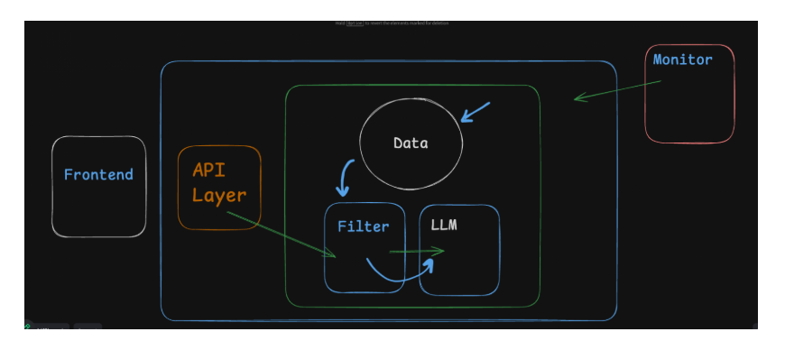

<p align="center">
  
</p>

<h1 align="center">🍽️ BiteAI — AI-Powered Restaurant Recommender</h1>

<p align="center">
  <strong>Discover your perfect meal in Bangalore with AI-ranked, data-driven restaurant recommendations.</strong>
</p>

<p align="center">
  <a href="#-features">Features</a> •
  <a href="#%EF%B8%8F-architecture">Architecture</a> •
  <a href="#-tech-stack">Tech Stack</a> •
  <a href="#-quick-start">Quick Start</a> •
  <a href="#-api-reference">API Reference</a> •
  <a href="#-deployment">Deployment</a>
</p>

<p align="center">
  
  
  
  
  
  
</p>

---

## 📸 Preview

<p align="center">
  
</p>

---

## ✨ Features

| Feature | Description |
|---------|-------------|
| 🔍 **Smart Search** | Natural language search — type _"butter chicken under 800 near Indiranagar"_ and get instant results |
| 🤖 **AI-Ranked Results** | LLM (Groq Llama 3.1) ranks restaurants with personalized explanations for each pick |
| 🎯 **Deterministic Filtering** | Locality, cuisine, budget, rating — all filters are applied _before_ the LLM touches the data |
| 🍕 **Dish-to-Cuisine Mapping** | Search for "pizza" and the system auto-maps it to Italian cuisine |
| 📍 **Cascaded Dropdowns** | Select a locality → cuisine dropdown updates to show only cuisines available there |
| 💰 **Budget Range** | Dual min/max budget controls with real restaurant cost data |
| ⚡ **In-Memory Cache** | Identical queries return instantly — no redundant LLM calls |
| 🛡️ **Graceful Fallback** | If the LLM is unavailable, deterministic ranking (rating × log votes) kicks in seamlessly |
| 📊 **Transparency** | Every response includes latency, token usage, cache status, and reason codes |
| 🎨 **Modern UI** | Zomato-inspired red theme with glassmorphism cards, smooth animations, and responsive design |

---

## 🏗️ Architecture

```
┌──────────────────────────────────────────────────────────────────┐
│                        FRONTEND (Next.js)                        │
│  SearchCard → useRecommend hook → api.ts → GET/POST endpoints   │
└──────────────┬───────────────────────────────────────────────────┘
               │  HTTP (JSON)
               ▼
┌──────────────────────────────────────────────────────────────────┐
│                      FASTAPI BACKEND                             │
│                                                                  │
│  ┌─────────────┐   ┌─────────────┐   ┌──────────────────────┐  │
│  │  Phase 1    │──▶│  Phase 2    │──▶│      Phase 3         │  │
│  │  Data       │   │  Filter     │   │   Orchestrator       │  │
│  │  Foundation │   │  Pipeline   │   │                      │  │
│  │             │   │             │   │  Intent Parser       │  │
│  │  • Ingest   │   │  • Locality │   │  Dish→Cuisine Map    │  │
│  │  • Clean    │   │  • Cuisine  │   │  Scenario Filter     │  │
│  │  • Normalize│   │  • Budget   │   │  Prompt Builder      │  │
│  │  • Parquet  │   │  • Rating   │   │  Groq LLM Client     │  │
│  │             │   │  • Chain cap│   │  Deterministic        │  │
│  │             │   │  • Rank     │   │    Fallback           │  │
│  └─────────────┘   └─────────────┘   └──────────┬───────────┘  │
│                                                  │               │
│                                    ┌─────────────▼────────────┐ │
│                                    │      Phase 4             │ │
│                                    │   API + Schemas          │ │
│                                    │   (FastAPI endpoints)    │ │
│                                    └──────────────────────────┘ │
└──────────────────────────────────────────────────────────────────┘
               │
               ▼
        ┌──────────────┐
        │   Groq API   │
        │  (Llama 3.1) │
        └──────────────┘
```

### Pipeline Flow

```
User Input ──▶ Parse Intent (dish, locality, budget from text)
           ──▶ Build Effective Preferences
           ──▶ Deterministic Filter (locality → cuisine → budget → rating)
           ──▶ Scenario Filter (date night, quick bite, etc.)
           ──▶ Persona Sort (budget-friendly vs premium)
           ──▶ Primary Cuisine Priority Sort
           ──▶ LLM Ranking + Explanations (Groq)
           ──▶ ID Validation (drop hallucinated IDs)
           ──▶ Merge with Catalog (authoritative data)
           ──▶ Response with items, rejected list, and meta
```

---

## 🛠 Tech Stack

| Layer | Technology |
|-------|-----------|
| **Backend** | Python 3.11+ · FastAPI · Pydantic v2 · Uvicorn |
| **Data** | pandas · PyArrow · Parquet |
| **LLM** | Groq API · Llama 3.1 8B Instant |
| **Frontend** | Next.js 16 · React 19 · TypeScript · Vanilla CSS |
| **Dataset** | [Zomato Restaurant Recommendation](https://huggingface.co/datasets/ManikaSaini/zomato-restaurant-recommendation) (~51,000 Bangalore restaurants) |
| **Deployment** | Render (backend) · Vercel (frontend) · Streamlit Cloud (alt) |

---

## 🚀 Quick Start

### Prerequisites

- Python 3.11+
- Node.js 18+
- [Groq API key](https://console.groq.com/) (free tier available)

### 1. Clone the repository

```bash
git clone https://github.com/mathurkartik/zomato.git
cd zomato
```

### 2. Backend setup

```bash
# Create virtual environment (recommended)
python -m venv venv
# Windows
venv\Scripts\activate
# macOS/Linux
source venv/bin/activate

# Install dependencies
pip install -r requirements.txt

# Set up environment variables
cp .env.example .env
# Edit .env and add your Groq API key:
# GROQ_API_KEY=your_key_here

# Ingest dataset (first time only)
python scripts/ingest_zomato.py

# Start backend server
uvicorn src.phase4.app:app --host 0.0.0.0 --port 8000
```

The API will be available at `http://localhost:8000`. Check health at `http://localhost:8000/health`.

### 3. Frontend setup

```bash
cd frontend

# Install dependencies
npm install

# Set up environment variables
cp .env.example .env.local
# .env.local should contain:
# NEXT_PUBLIC_API_URL=http://localhost:8000

# Start development server
npm run dev
```

The frontend will be available at `http://localhost:3000`.

### 4. Streamlit alternative (optional)

If you prefer a quick Streamlit UI without the Next.js frontend:

```bash
# From project root
streamlit run streamlit_app.py
```

---

## 📖 API Reference

### Health Check

```
GET /health
```

**Response:**
```json
{
  "status": "ok",
  "catalog_rows": 51717
}
```

### Get Filter Options

```
GET /api/v1/filters
```

Returns available localities, cuisines, rating options, budget range, and feature counts.

### Get Cuisines for Locality (Cascaded)

```
GET /api/v1/filters/cuisines?locality=indiranagar
```

Returns cuisines available in a specific locality for cascaded dropdown UX.

### Cuisine Distribution Summary

```
GET /api/v1/filters/cuisines/summary?locality=indiranagar&limit=12
```

Returns top cuisine counts in a locality (for heatmap/informed choice).

### Dynamic Filter Counts

```
POST /api/v1/filters/counts
```

**Body:**
```json
{
  "locality": "indiranagar",
  "cuisine": "north indian",
  "budget_min_inr": 200,
  "budget_max_inr": 1000,
  "min_rating": 3.5
}
```

Returns live counts for online ordering and table booking given current filters.

### Get Recommendations

```
POST /api/v1/recommend
```

**Body:**
```json
{
  "locality": "indiranagar",
  "cuisine": "north indian",
  "budget_min_inr": 200,
  "budget_max_inr": 1000,
  "min_rating": 3.5,
  "persona": "premium",
  "online_order": null,
  "book_table": null,
  "specific_cravings": "butter chicken for date night"
}
```

**Response:**
```json
{
  "summary": "AI-generated summary of recommendations...",
  "items": [
    {
      "id": "a1b2c3d4e5f6",
      "rank": 1,
      "name": "Restaurant Name",
      "locality": "Indiranagar",
      "cuisines": ["north indian", "mughlai"],
      "rating": 4.5,
      "cost_for_two": 800,
      "cost_display": "₹800 for two",
      "rest_type": "Casual Dining",
      "weighted_score": 28.1,
      "votes": 890,
      "explanation": "AI-generated reason for this recommendation"
    }
  ],
  "rejected": [],
  "meta": {
    "shortlist_size": 15,
    "model": "llama-3.1-8b-instant",
    "prompt_version": "v1",
    "relaxed_rating": false,
    "cache_hit": false,
    "llm_used": true,
    "fallback_used": false,
    "latency_ms": 1200,
    "tokens_used": 450,
    "reason": null,
    "persona": "premium"
  }
}
```

### Interactive API Docs

Once the backend is running, visit:
- **Swagger UI:** `http://localhost:8000/docs`
- **ReDoc:** `http://localhost:8000/redoc`

---

## 📁 Project Structure

```
.
├── config.yaml                  # Backend tunables (filter caps, LLM settings)
├── requirements.txt             # Python dependencies
├── render.yaml                  # Render deployment blueprint
├── streamlit_app.py             # Streamlit UI (alternative frontend)
├── .env.example                 # Environment variable template
│
├── scripts/
│   ├── ingest_zomato.py         # Dataset download & ingestion
│   ├── audit_catalog.py         # Data quality audit
│   └── groq_smoke_tests.py      # LLM connectivity tests
│
├── src/
│   ├── config.py                # Loads config.yaml → AppConfig
│   ├── utils.py                 # Shared utilities
│   ├── phase1/                  # Data Foundation
│   │   ├── ingest.py            # Dataset download
│   │   ├── transform.py         # Cleaning, normalization, weighted scores
│   │   └── validate.py          # Row-level validation
│   ├── phase2/                  # Deterministic Filtering
│   │   ├── catalog_loader.py    # Parquet loader + filter helpers
│   │   ├── filter.py            # Multi-stage filter pipeline
│   │   └── preferences.py       # UserPreferences Pydantic model
│   ├── phase3/                  # AI Orchestration
│   │   ├── orchestrator.py      # Main recommend() entry point
│   │   ├── groq_client.py       # Groq API client
│   │   ├── prompt_builder.py    # LLM prompt construction
│   │   ├── intent_parser.py     # Scenario detection from text
│   │   ├── query_parser.py      # Dish/locality/budget extraction
│   │   ├── dish_mapping.py      # Dish → cuisine mapping
│   │   ├── scenario_config.py   # Scenario rules configuration
│   │   ├── scenario_filter.py   # Scenario-based shortlist filtering
│   │   └── monitor.py           # Recommendation tracing & logging
│   └── phase4/                  # API Layer
│       ├── app.py               # FastAPI application
│       └── schemas.py           # Request/response Pydantic models
│
├── frontend/                    # Next.js Frontend
│   ├── src/
│   │   ├── pages/
│   │   │   ├── index.tsx        # Main page
│   │   │   ├── _app.tsx         # Global styles + layout
│   │   │   └── _document.tsx    # Google Fonts, meta
│   │   ├── components/
│   │   │   ├── Header.tsx       # Sticky nav with brand + health badge
│   │   │   ├── HeroSection.tsx  # Full-viewport hero with search
│   │   │   ├── SearchCard.tsx   # Chat input, pills, filters, budget
│   │   │   ├── RestaurantCard.tsx # Result card with AI explanation
│   │   │   └── ResultsSection.tsx # Results grid, empty states, meta
│   │   ├── hooks/
│   │   │   └── useRecommend.ts  # Filter state + API integration
│   │   ├── lib/
│   │   │   ├── api.ts           # Typed fetch wrappers
│   │   │   ├── cuisineVisual.ts # Cuisine → image/color mapping
│   │   │   └── formatLocality.ts # Locality display formatting
│   │   └── styles/
│   │       └── globals.css      # Full design system (Zomato-red theme)
│   ├── package.json
│   └── .env.example
│
├── data/
│   └── processed/
│       └── restaurants.parquet  # Cleaned catalog (~51k rows)
│
├── tests/
│   ├── test_phase2_filter.py    # Filter pipeline tests
│   ├── test_phase3_llm.py       # LLM integration tests
│   ├── test_phase4_api.py       # API endpoint tests
│   └── test_improvements.py     # Regression tests
│
├── design/                      # UI screenshots & assets
└── Docs/                        # Architecture & improvement docs
    └── phase-wise-architecture.md
```

---

## ⚙️ Configuration

### Backend (`config.yaml`)

```yaml
data:
  processed_catalog: data/processed/restaurants.parquet
  cost_min_valid: 100              # Rows below this cost are dropped

filter:
  max_shortlist_candidates: 40     # Max rows passed to LLM
  chain_max_per_name: 2            # Max outlets of same restaurant in shortlist
  relax_rating_by: 0.5             # Rating relaxation on sparse results
  thin_locality_threshold: 3       # Min results before "thin locality" warning

llm:
  model: llama-3.1-8b-instant
  temperature: 0.3
  max_tokens: 1200
  top_k_results: 5
  timeout_seconds: 15
  prompt_version: v1
```

### Environment Variables

| Variable | Location | Description |
|----------|----------|-------------|
| `GROQ_API_KEY` | `.env` (root) | Groq API key for LLM ranking |
| `NEXT_PUBLIC_API_URL` | `frontend/.env.local` | Backend URL (default: `http://localhost:8000`) |

---

## 🧪 Testing

```bash
# Run all tests
pytest

# Run specific test suites
pytest tests/test_phase2_filter.py -v
pytest tests/test_phase3_llm.py -v
pytest tests/test_phase4_api.py -v

# Groq connectivity smoke test
python scripts/groq_smoke_tests.py
```

---

## 🚢 Deployment

### Backend → Render

This repo includes a `render.yaml` blueprint for one-click deployment:

1. Create a **Blueprint** in [Render](https://render.com) from this GitHub repo
2. Render auto-detects `render.yaml` and creates the `zomato-fastapi` service
3. Add secret env var: `GROQ_API_KEY=your_key`
4. Deploy and wait for build

Your API will be at: `https://<your-service>.onrender.com`

### Frontend → Vercel

1. Import the `frontend/` directory in [Vercel](https://vercel.com)
2. Set environment variable: `NEXT_PUBLIC_API_URL=https://<your-render-service>.onrender.com`
3. Deploy

### Streamlit Cloud (Alternative)

1. Push repo to GitHub
2. Create new app in [Streamlit Cloud](https://streamlit.io/cloud) from this repo
3. Set main file: `streamlit_app.py`
4. Add secret: `GROQ_API_KEY=your_key`

> **Note:** If `GROQ_API_KEY` is not set, the app still works using deterministic fallback recommendations.

---

## 🔑 Key Design Decisions

| Decision | Rationale |
|----------|-----------|
| **Deterministic retrieval** | LLM is used _only_ for ranking and explanations — never for data retrieval. This ensures consistent, auditable results. |
| **Dish → Cuisine mapping** | The dataset is cuisine-level, not dish-level. Searching "biryani" maps to "north indian" for filtering, then the LLM can prioritize biryani-serving restaurants. |
| **Budget as number, not enum** | Users enter `₹800` directly. Simpler filter logic than "low/medium/high" buckets. |
| **Extras as LLM hints** | Tags like "veg", "rooftop", "romantic" are passed to the LLM as _hints_ — not hard filters — because the dataset lacks reliable attribute columns. |
| **Chain dominance cap** | Max 2 outlets per restaurant name prevents one chain from monopolizing results. |
| **Graceful degradation** | No hard crash on LLM failures. Cache → LLM → Retry → Deterministic fallback. |

---

## 📊 Empty State Reason Codes

The API returns structured reason codes when no results are found:

| Code | Meaning |
|------|---------|
| `OK` | Results found successfully |
| `NO_LOCALITY_MATCH` | The selected locality doesn't exist in the catalog |
| `NO_CUISINE_MATCH` | No restaurants serve this cuisine in the selected locality |
| `NO_RESULTS` | Filters are too restrictive — no matches found |
| `THIN_LOCALITY` | Too few results even after rating relaxation |
| `BUDGET_TOO_LOW` | Budget is below the cheapest restaurant in the locality |

---

## 🤝 Contributing

1. Fork the repository
2. Create a feature branch (`git checkout -b feature/amazing-feature`)
3. Commit your changes (`git commit -m 'Add amazing feature'`)
4. Push to the branch (`git push origin feature/amazing-feature`)
5. Open a Pull Request

---

## 📄 License

This project is open source and available under the [MIT License](LICENSE).

---

<p align="center">
  Built with ❤️ by <a href="https://github.com/mathurkartik">Kartik Mathur</a>
</p>